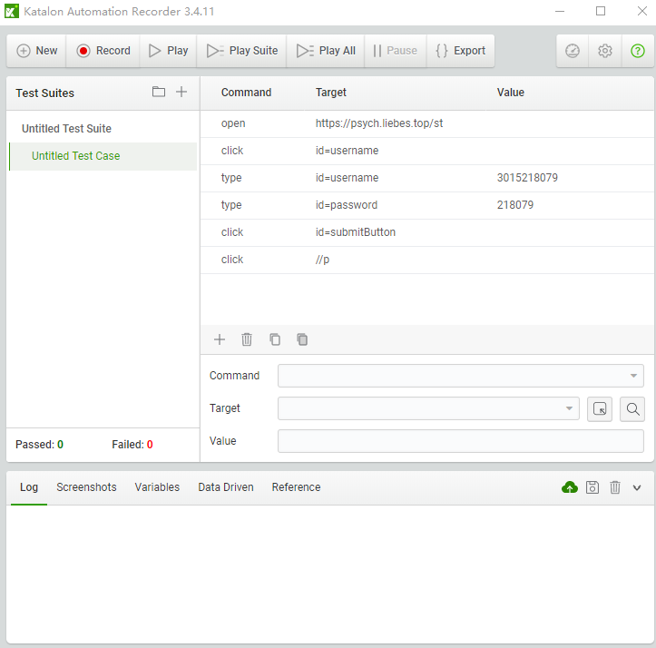
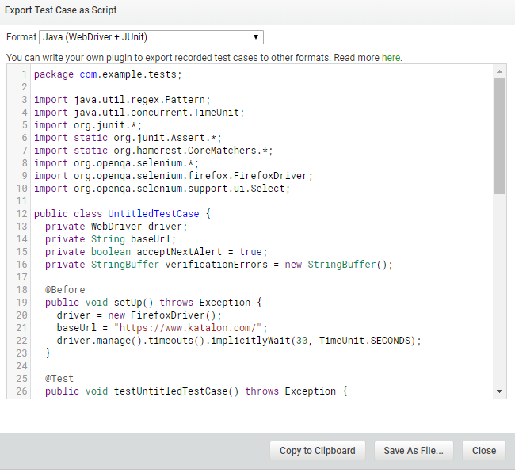

## 软件测试第二次上机实验+——Selenium的使用
### 实验要求
- 1、安装SeleniumIDE插件
- 2、学会使用SeleniumIDE录制脚本和导出脚本
- 3、访问https://psych.liebes.top/st 使用学号登录系统，进入系统后可以看到该同学的git地址。
- 4、编写Selenium Java WebDriver程序，测试input.xlsx表格中的学号和git地址的对应关系是否正确。
- 5、将测试代码提交到github上

### 实验步骤
- 1、安装SeleniumIDE插件
这个由于Firefox版本更新的问题带来诸多不便（例如无法导入成java等原因），这里使用Chrome extension: Katalon Automation Record作为代替使用（啊对，需要翻墙。。。），使用时直接录制在网页上的操作即可录制脚本和导出脚本。

- 2、学会使用SeleniumIDE录制脚本和导出脚本
如下是挺好看的界面


那个红点是录制键，点击后进行相关操作会被记录到表中，最后将完成的步骤再进行export导出成java文件即可



- 3、使用Selenium Java WebDriver程序，测试正确性
帐户名和密码全部保存在input.xlsx文件中，我们需要对其进行读取操作以及进行webDriver验证操作
由于已经在katalon中录制好了相关的操作，现在只需要将从文件中读取到的账号密码对进行循环登录即可

**准备工作**

1.下载火狐浏览器，以供登录Driver的操作
2.下载供java启动火狐浏览器使用的[geckodriver.exe](https://www.geckodrive.com/)程序，并放到可以读取的目录下
3.下载[Selenium Java](https://www.seleniumhq.org/download/)，可以是最新版本
4.下载供读取xlsx文件的[apache poi驱动](https://poi.apache.org/download.html#POI-3.17)
5.将以上所有的jar文件全部添加到相关的路径中去，具体操作是，项目目录右键-->Properties-->Java Build Path-->Libraries-->Add JARs

将循环和验证结合起来，写成一个测试用例，最后run起来（相关代码已经上传到GitHub上面去了）

### 实验注意事项
1.有些格式存在误差导致验证失败，例如地址栏与准确的相比多出'/'，因此这里自定义一个函数让地址格式化
```java
  public String format (String s) {
	  if (s.endsWith("/"))
    	  s = s.substring(0, s.length()-1);
      return s;
  }
```

2.有些格式存在类型不正确的问题，即科学计数法显示整数，这让验证工作无法进行，这里也对相关的类型进行转化
```java
  if (stNumber.getCellTypeEnum().equals(CellType.NUMERIC)) {
      number = new BigDecimal(stNumber.getNumericCellValue()).toString();
      System.out.print(number + " ");
  } else {
      number = stNumber.toString();
      System.out.print(number + " ");
  }
```

3.有些同学没有上传相关的地址，导致无法登录，这里遇到空或者null的话就跳过循环就好
```java
if (addr == null || addr == "")
   continue;
```
